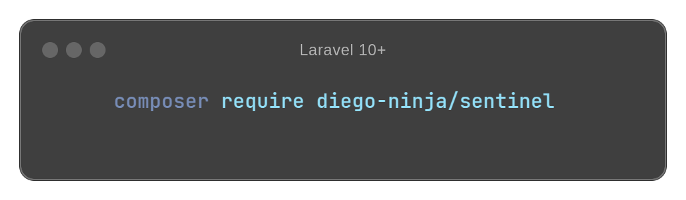

<p align="center">
    
</p>

[](https://www.laravel.com)
[](https://packagist.org/packages/diego-ninja/laravel-censor)
[](https://packagist.org/packages/diego-ninja/laravel-censor)

[](https://opensource.org/licenses/MIT)

[](https://hitsofcode.com/github/diego-ninja/laravel-censor/view?branch=main&label=hits-of-code)
[](https://wakatime.com/badge/user/bd65f055-c9f3-4f73-92aa-3c9810f70cc3/project/f5c4a047-d754-4ef3-b7b0-89ff0099a601)
[![PHPStan Level][ico-phpstan]][link-phpstan]

# Introduction

A powerful and flexible profanity filtering package for Laravel 10+ applications. Filter offensive content using multiple services or local dictionaries.

This documentation has been generated almost in its entirety using 🦠 [Claude 3.5 Sonnet](https://claude.ai/) based on source code analysis. Some sections may be incomplete, outdated or may contain documentation for planned or not-released features. For the most accurate information, please refer to the source code or open an issue on the package repository.

## ❤️ Features

- Multiple profanity checking services support (Local, [PurgoMalum](https://www.purgomalum.com/), [Azure AI](https://azure.microsoft.com/en-us/pricing/details/cognitive-services/content-safety/), [Perspective AI](https://perspectiveapi.com/), [Tisane AI](https://tisane.ai/))
- Multi-language support
- Whitelist functionality
- Different detection strategies (exact with trie, pattern, n-gram, variation, repeated chars, levenshtein)
- Laravel Facade and helper functions
- Laravel controller
- Custom validation rule
- Configurable dictionaries

## Planned Features
- Unicode support

## 📦 Installation

You can install the package via composer:

```bash
composer require diego-ninja/laravel-censor
```

After installing, publish the configuration file and dictionaries:

```bash
php artisan vendor:publish --tag="censor-config"
php artisan vendor:publish --tag="censor-dictionaries"
```

## 🎛️ Configuration

The package configuration file will be published at `config/censor.php`. Here you can configure:

- Default language
- Available languages
- Default profanity service
- Mask character for censored words
- Character replacements for evasion detection
- Whitelist of allowed words
- Dictionary path
- Service-specific configurations

### API Keys Configuration

Some services require API keys. Add these to your `.env` file:

```env
CENSOR_THRESHOLD_SCORE=0.5
PERSPECTIVE_AI_API_KEY=your-perspective-api-key
TISANE_AI_API_KEY=your-tisane-api-key
AZURE_AI_API_KEY=your-azure-api-key
AZURE_AI_ENDPOINT=your-azure-endpoint
```

## ⚙️ Basic Usage

You can use Laravel Censor in three ways:

### 1. Facade

```php
use Ninja\Censor\Facades\Censor;

// Check if text contains offensive content
$isOffensive = Censor::offensive('some text');

// Get cleaned version of text
$cleanText = Censor::clean('some text');

// Get detailed analysis
$result = Censor::check('some text');
```

### 2. Helper Functions

```php
// Check if text is offensive
$isOffensive = is_offensive('some text');

// Clean offensive content
$cleanText = clean('some text');
```

### 3. Validation Rule

```php
$rules = [
    'comment' => ['required', 'string', 'censor_check']
];
```

## Available Services

### Local Censor

Uses local dictionaries for offline profanity checking.

```php
use Ninja\Censor\Enums\Provider;

$result = Censor::with(Provider::Local, 'text to check');
```

### PurgoMalum

Free web service for profanity filtering.

```php
$result = Censor::with(Service::PurgoMalum, 'text to check');
```

### Azure AI Content Safety

Uses Azure's AI content moderation service.

```php
$result = Censor::with(Service::Azure, 'text to check');
```

### Perspective AI

Uses Google's Perspective API for content analysis.

```php
$result = Censor::with(Service::Perspective, 'text to check');
```

### Tisane AI

Natural language processing service for content moderation.

```php
$result = Censor::with(Service::Tisane, 'text to check');
```

## Working with Results

All services return a Result object with consistent methods:

```php
$result = Censor::check('some text');

$result->offensive();    // bool: whether the text contains offensive content
$result->words();        // array: list of matched offensive words
$result->replaced();     // string: text with offensive words replaced
$result->original();     // string: original text
$result->score();        // ?float: offensive content score (if available)
$result->confidence();   // ?float: confidence level (if available)
$result->categories();   // ?array: detected categories (if available)
```

## Response Caching

External service responses are automatically cached to improve performance and reduce API calls. By default, all external services (PurgoMalum, Azure AI, Perspective AI, and Tisane AI) will cache their responses for 1 hour.

The local censor service is not cached as it's already performant enough.

### Configuring Cache

You can configure the cache TTL and cache store in your `.env` file:

```env
CENSOR_CACHE_ENABLED=true # Enable caching (default: true)
CENSOR_CACHE_TTL=3600 # Cache duration in seconds (default: 1 hour)
CENSOR_CACHE_STORE=redis # Cache store (default: file)
```

Or in your `config/censor.php`:

```php
    'cache' => [
        'enabled' => env('CENSOR_CACHE_ENABLED', true),
        'store' => env('CENSOR_CACHE_STORE', 'file'),
        'ttl' => env('CENSOR_CACHE_TTL', 60),
    ],
```

The caching system uses Laravel's cache system, so it will respect your cache driver configuration (`config/cache.php`). You can use any cache driver supported by Laravel (Redis, Memcached, file, etc.).

### Cache Keys

Cache keys are generated using the following format:
```
censor:{ServiceName}:{md5(text)}
```

For example:
```
censor:PurgoMalum:a1b2c3d4e5f6g7h8i9j0
```

This ensures unique caching for:
- Different services checking the same text
- Same service checking different texts
- Different environments using the same cache store

## Detection Mechanism

The local checker uses a multi-strategy approach to detect offensive content accurately. Each piece of text is processed through different detection strategies in sequence:

1. **Pattern Strategy**: Handles exact matches and character substitutions (like '@' for 'a', '1' for 'i'). This is the primary detection method and uses precompiled regular expressions for efficiency.

2. **NGram Strategy**: Detects offensive phrases by analyzing word combinations. Unlike single-word detection, this strategy can identify offensive content that spans multiple words.

3. **Variation Strategy**: Catches attempts to evade detection through character separation (like 'f u c k' or 'f.u.c.k'). This strategy understands various separator patterns while respecting word boundaries.

4. **Repeated Chars Strategy**: Identifies words with intentionally repeated characters (like 'fuuuck'). This helps catch common obfuscation techniques.

5. **Levenshtein Strategy**: Uses string distance comparison to find words that are similar to offensive terms, helping catch typos and intentional misspellings.

Each strategy can operate in either full word or partial matching mode, with full word mode ensuring that matches are not part of larger words (preventing false positives like 'class' matching 'ass'). Results from all strategies are combined, deduplicated, and scored based on the type and quantity of matches found.

## Custom Dictionaries

You can add your own dictionaries or modify existing ones:

1. Create a new PHP file in your `resources/dict` directory
2. Return an array of words to be censored
3. Update your config to include the new language

```php
// resources/dict/custom.php
return [
    'word1',
    'word2',
    // ...
];

// config/censor.php
'languages' => ['en', 'custom'],
```

## Whitelist

You can whitelist words to prevent them from being censored:

```php
// config/censor.php
'whitelist' => [
    'word1',
    'word2',
],
```

## Character Substitution

The package detects common character substitutions (e.g., @ for a, 1 for i). Configure these in:

```php
// config/censor.php
'replacements' => [
    'a' => '(a|@|4)',
    'i' => '(i|1|!)',
    // ...
],
```

## 🙏 Credits

This project is developed and maintained by 🥷 [Diego Rin](https://diego.ninja) in his free time.

Special thanks to:

- [Laravel Framework](https://laravel.com/) for providing the most exciting and well-crafted PHP framework.
- [Snipe](https://github.com/snipe) for developing the [inital code](https://github.com/snipe/banbuilder) that serves Laravel Censor as starting point.
- All the contributors and testers who have helped to improve this project through their contributions.

If you find this project useful, please consider giving it a ⭐ on GitHub!

[ico-phpstan]: https://img.shields.io/badge/phpstan-max-blue?logo=data:image/png;base64,iVBORw0KGgoAAAANSUhEUgAAACAAAAAgCAYAAABzenr0AAAGb0lEQVR42u1Xe1BUZRS/y4Kg8oiR3FCCBUySESZBRCiaBnmEsOzeSzsg+KxYYO9dEEftNRqZjx40FRZkTpqmOz5S2LsXlEZBciatkQnHDGYaGdFy1EpGMHl/p/PdFlt2rk5O+J9n5nA/vtf5ned3lnlISpRhafBlLRLHCtJGVrB/ZBDsaw2lUqzReGAC46DstTYfnSCGUjaaDvgxACo6j3vUenNdImeRXqdnWV5az5rrnzeZznj8J+E5Ftsclhf3s4J4CS/oRx5Bvon8ZU65FGYQxAwcf85a7CeRz+C41THejueydCZ7AAK34nwv3kHP/oUKdOL4K7258fF7Cud427O48RQeGkIGJ77N8fZqlrcfRP4d/x90WQfHXLeBt9dTrSlwl3V65ynWLM1SEA2qbNQckbe4Xmww10Hmy3shid0CMcmlEJtSDsl5VZBdfAgMvI3uuR+moJqN6LaxmpsOBeLCDmTifCB92RcQmbAUJvtqALc5sQr8p86gYBCcFdBq9wOin7NQax6ewlB6rqLZHf23FP10y3lj6uJtEBg2HxiVCtzd3SEwMBCio6Nh9uzZ4O/vLwOZ4OUNM2NyIGPFrvuzBG//lRPs+VQ2k1ki+ePkd84bskz7YFpYgizEz88P8vPzYffu3dDS0gJNTU1QXV0NqampRK1WIwgfiE4qhOyig0rC+pCvK8QUoML7uJVHA5kcQUp3DSpqWjc3d/Dy8oKioiLo6uqCoaEhuHb1KvT09AAhBFpbW4lOpyMyyIBQSCmoUQLQzgniNvz+obB2HS2RwBgE6dOxCyJogmNkP2u1Wrhw4QJ03+iGrR9XEd3CTNBn6eCbo40wPDwMdXV1BF1DVG5qiEtboxSUP6J71+D3NwUAhLOIRQzm7lnnhYUv7QFv/yDZ/Lm5ubK2DVI9iZ8bR8JDtEB57lNzENQN6OjoIGlpabIVZsYaMTO+hrikRRA1JxmSX9hE7/sJtVyF38tKsUCVZxBhz9jI3wGT/QJlADzPAyXrnj0kInzGHQCRMyOg/ed2uHjxIuE4TgYQHq2DLJqumashY+lnsMC4GVC5do6XVuK9l+4SkN8y+GfYeVJn2g++U7QygPT0dBgYGIDvT58mnF5PQcjC83PzSF9fH7S1tZGEhAQZQOT8JaA317oIkM6jS8uVLSDzOQqg23Uh+MlkOf00Gg0cP34c+vv74URzM9n41gby/rvvkc7OThlATU3NCGYJUXt4QaLuTYwBcTSOBmj1RD7D4Tsix4ByOjZRF/zgupDEbgZ3j4ly/qekpND0o5aQ44HS4OAgsVqtI1gTZO01IbG0aP1bknnxCDUvArHi+B0lJSlzglTFYO2udF3Ql9TCrHn5oEIreHp6QlRUFJSUlJCqqipSWVlJ8vLyCGYIFS7HS3zGa87mv4lcjLwLlStlLTKYYUUAlvrlDGcW45wKxXX6aqHZNutM+1oQBHFTewAKkoH4+vqCj48PYAGS5yb5amjNoO+CU2SL53NKpDD0vxHHmOJir7L5xUvZgm0us2R142ScOIyVqYvlpWU4XoHIP8DXL2b+wjdWeXh6U2FjmIIKmbWAYPFRMus62h/geIvjOQYlpuDysQrLL6Ger49HgW8jqvXUhI7UvDb9iaSTDqHtyItiF5Suw5ewF/Nd8VJ6zlhsn06bEhwX4NyfCvuGEeRpTmh4mkG68yDpyuzB9EUcjU5awbAgncPlAeSdAQER0zCndzqVbeXC4qDsMpvGEYBXRnsDx4N3Auf1FCTjTIaVtY/QTmd0I8bBVm1kejEubUfO01vqImn3c49X7qpeqI9inIgtbpxK3YrKfIJCt+OeV2nfUVFR4ca4EkVENyA7gkYcMfB1R5MMmxZ7ez/2KF5SSN1yV+158UPsJT0ZBcI2bRLtIXGoYu5FerOUiJe1OfsL3XEWH43l2KS+iJF9+S4FpcNgsc+j8cT8H4o1bfPg/qkLt50uJ1RzdMsGg0UqwfEN114Pwb1CtWTGg+Y9U5ClK9x7xUWI7BI5VQVp0AVcQ3bZkQhmnEgdHhKyNSZe16crtBIlc7sIb6cRLft2PCgoKGjijBDtjrAQ7a3EdMsxzIRflAFIhPb6mHYmYwX+WBlPQgskhgVryyJCQyNyBLsBQdQ6fgsQhyt6MSOOsWZ7gbH8wETmgRKAijatNL8Ngm0xx4tLcsps0Wzx4al0jXlI40B/A3pa144MDtSgAAAAAElFTkSuQmCC
[link-phpstan]: https://phpstan.org/